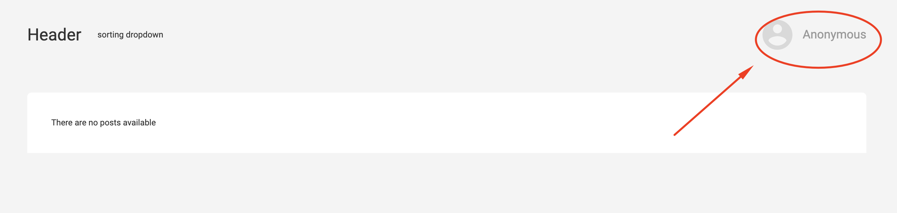
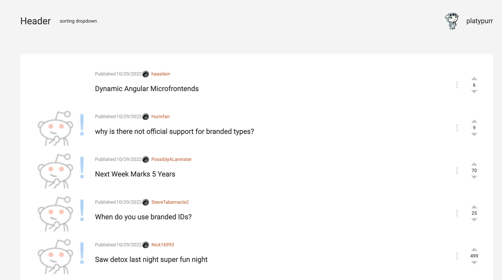

# Description

This app is mirroring your reddit account and show your main feed.

## Available features:
- login to your account

- show the posts in your feed

- click on the post card open the post in the modal window with comments

- infinite scroll combined with "Load more" btn

## How to run:
- clone the repo
- `npm install`
- `npm run dev`
- Click to "Anonymous" to log in to your reddit account
